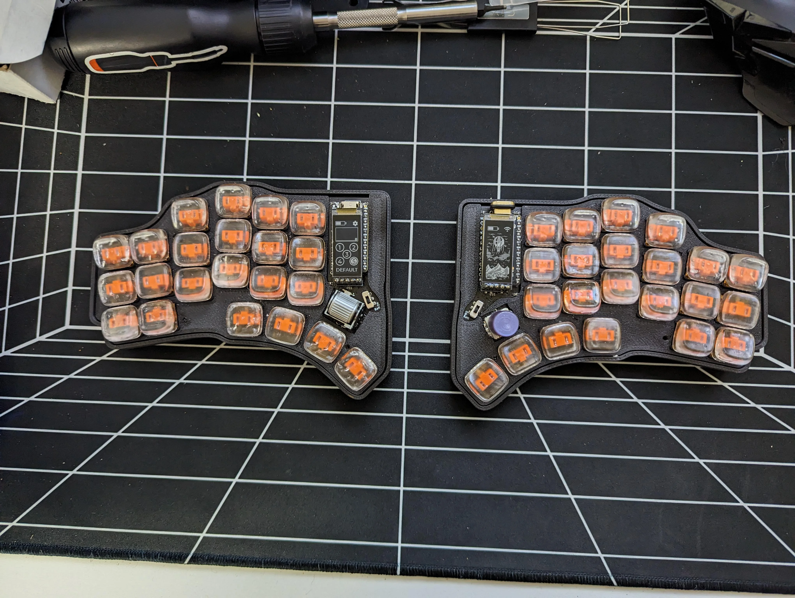
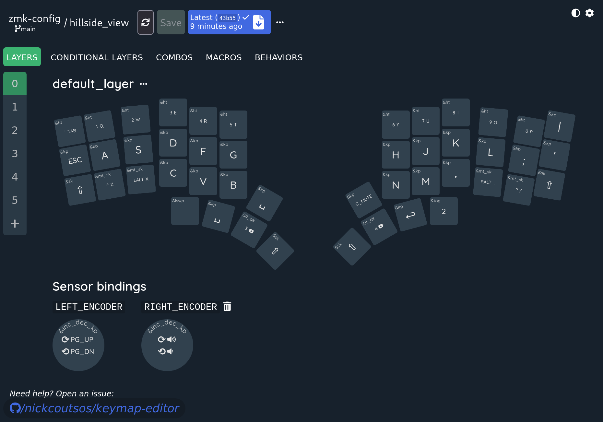
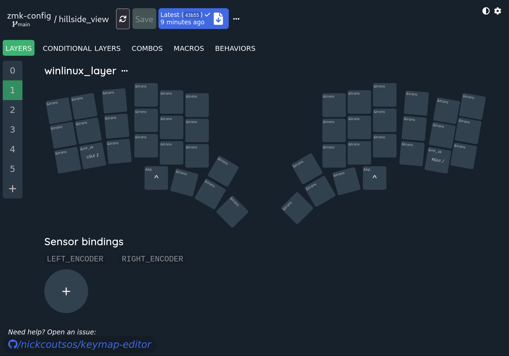
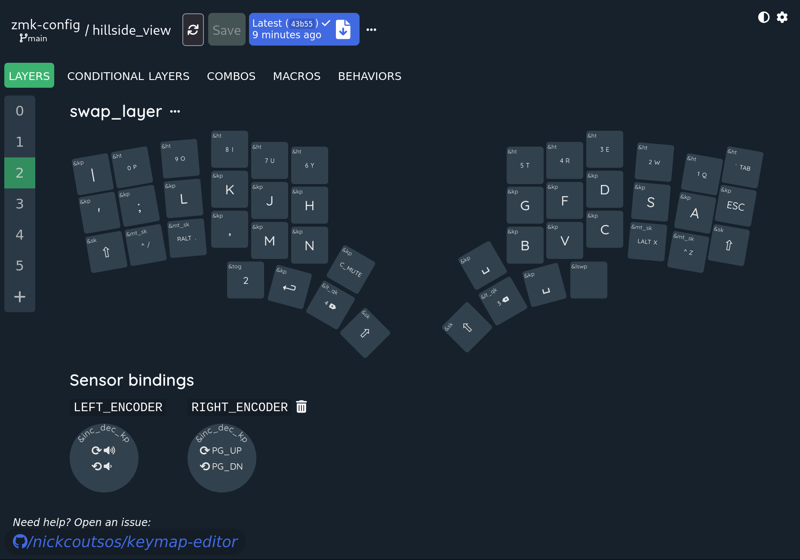
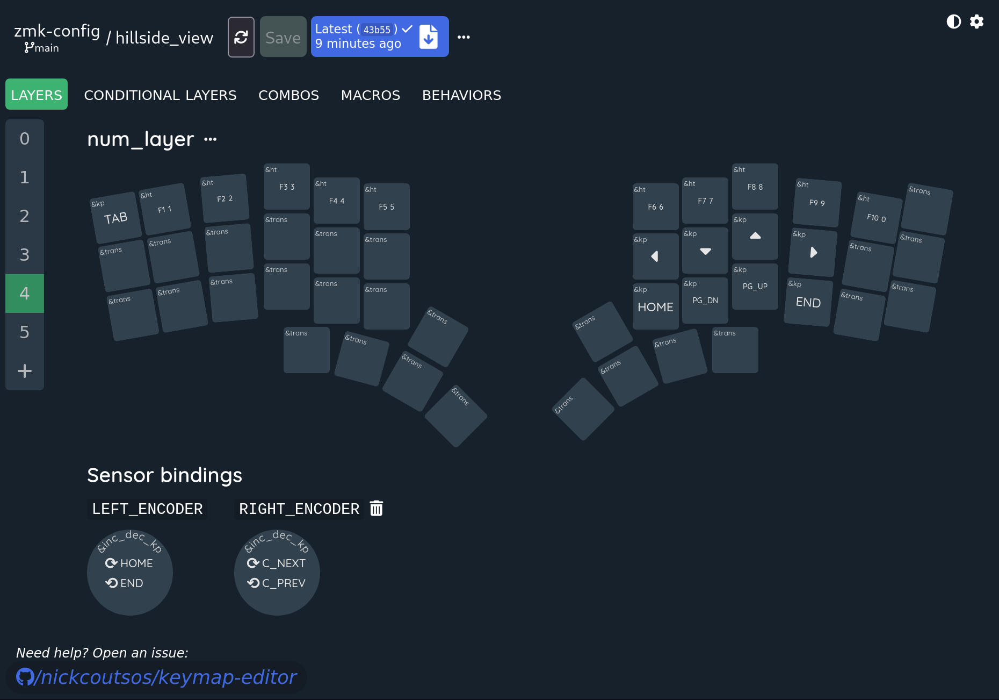
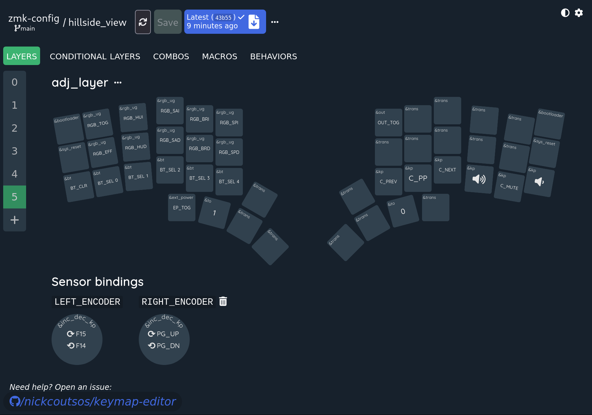

ZMK keymaps
===========

This repo contains configurations for my ZMK based keyboards

## Hillside View

[Hillside View](https://github.com/wannabecoffeenerd/HillSideView/) is a fork of [Hillside 46] with support for sharp display, bottom side MCU and future Cirque trackpad support.

### Layout

Made with https://nickcoutsos.github.io/keymap-editor/

